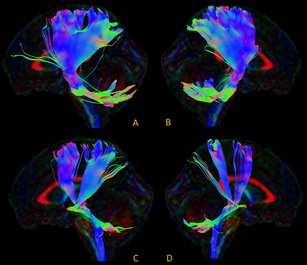
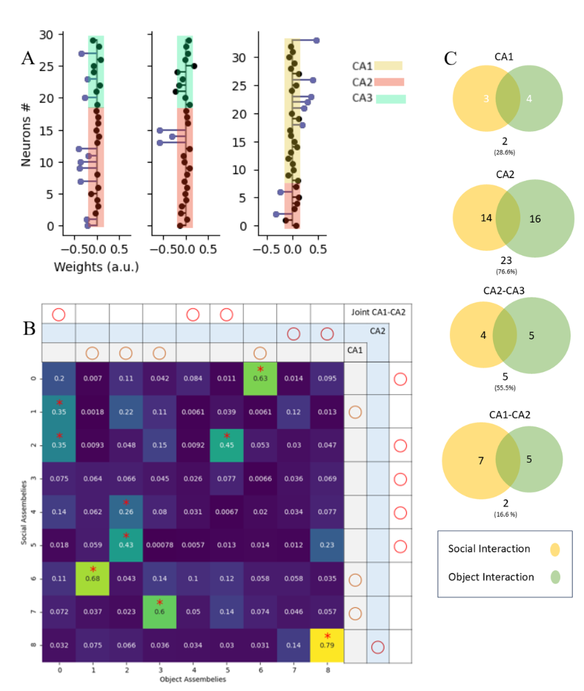

<!-- Main -->

<!-- One -->
<section id="one">
	

		<header class="major">
			<h2>Along-Tract Analysis of Cerebellar Pathways in MCI and AD</h2>
		</header>
		
<strong>Duration:</strong> April 2024 - July 2024 
		<strong>Supervisor:</strong> Dr. Samira Raminfard

		<h3>Overview</h3>
		
The cerebellum's role in cognition is increasingly recognized, but how do its cortical connections degrade in Alzheimer's? I worked on extracting and analyzing cerebellar white matter tracts to quantify structural changes.

		
			
			
 
				<strong>Figure 1.</strong> A: CPC-L (Cortico-Ponto-Cerebellar Left), B: CPC-R (Cortico-Ponto-Cerebellar Right), C: CTC-L (Cerebello-Thalamo-Cortical Left), D: CTC-R (Cerebello-Thalamo-Cortical Right)
			

		
		<h3>Methods</h3>
		
Used exploreDTI to isolate cortico-ponto-cerebellar (cortex → cerebellum) and cerebello-thalamo-cortical (cerebellum → cortex) pathways. Calculated FA (fractional anisotropy), MD (mean diffusivity), RD (radial diffusivity), and AD (axial diffusivity) along tract profiles. Set up comparison pipeline between MCI and AD patient groups.

		<h3>What I Learned</h3>

Working with diffusion imaging is messy. You need anatomical knowledge just to define the right ROIs, and tract extraction is all about tweaking parameters until things look right, which means artifacts can sneak in easily.

But the bigger question hit me while working with the along-tract analysis: how do we even decide where to split a tract? By anatomical regions? By where synapses are? And what about polysynaptic pathways? If signals jump between multiple neurons along the way, are we even capturing the real communication path? The tract looks continuous in the image, but the actual signal might be doing something completely different.

It made me realize these metrics show us structure—where the wires are, but not how information actually flows through them. That gap between what we measure and what's actually happening keeps bothering me.

		
<strong>Tools:</strong> exploreDTI, MATLAB, diffusion MRI analysis, tractography

	

</section>

<section id="two">
	

		<header class="major">
			<h2>The Influence of Salient Experiences on Hippocampal Activity Correlations</h2>
		</header>
		
<strong>Duration:</strong> November 2023 - September 2024 
		<strong>Supervisor:</strong> Dr. Tristan Manfred Stöber, Ruhr University, Bochum, Germany

		<h3>Overview</h3>
		
How do social experiences reshape the way neurons talk to each other? I analyzed cell assembly dynamics in the hippocampus—specifically CA2-CA3 regions—to see how spike patterns and correlations change after salient social interactions.

		<h3>Methods</h3>
		
Python-based electrophysiology analysis of spike trains. Examined correlations between neuronal firing patterns in CA2 and CA3 following social experiences to understand how cell assemblies reorganize.

			
			
			

				
A) Three examples of assemblies that exceeded the Marcenko-Pastur threshold from a representative session. Assembly members were identified as neurons with ICA weights exceeding an Otsu threshold, and assemblies with both CA2 and CA3 or CA1 and CA2 neuron members were named joint cell assemblies. B) Assembly Similarity Index matrix. Joint assemblies from social interaction were compared to non-social joint cell assemblies. This was calculated as the dot product of different assembly pairs, and a similarity index above the 95 percentile of a surrogate distribution was considered significant. C) Venn diagrams illustrate the proportions of assemblies detected in social (yellow) and object interaction conditions (green). 
			

		<h3>What I Learned</h3>
		
This was my first time working with single-neuron recordings. I'd always worked with macroscale data—MRI, fMRI, diffusion imaging—where you see big blobs of brain activity. But spikes? That's magic. You can actually watch individual neurons firing, see the exact timing of their conversations.

		
But honestly, I learned more than just technical skills. This was my first international collaboration, working remotely with Tristan's lab in Germany. Tristan is the kind of person who genuinely supports his students—no matter who you are or where you're from. His way of looking at the world, his approach to science and people, taught me a lot.

		
Working on an international team showed me something important: you learn to express your ideas clearly while staying independent in your thinking. You realize you're not the center of the world. When you work with people from different cultures, you see how many ways there are to approach the same problem. You're just one part of a bigger team, and that team only works when everyone takes responsibility for their piece and brings their own perspective. That's how you actually create something valuable.

		
<strong>Tools:</strong> Python, electrophysiology analysis, spike train analysis

	

</section>

